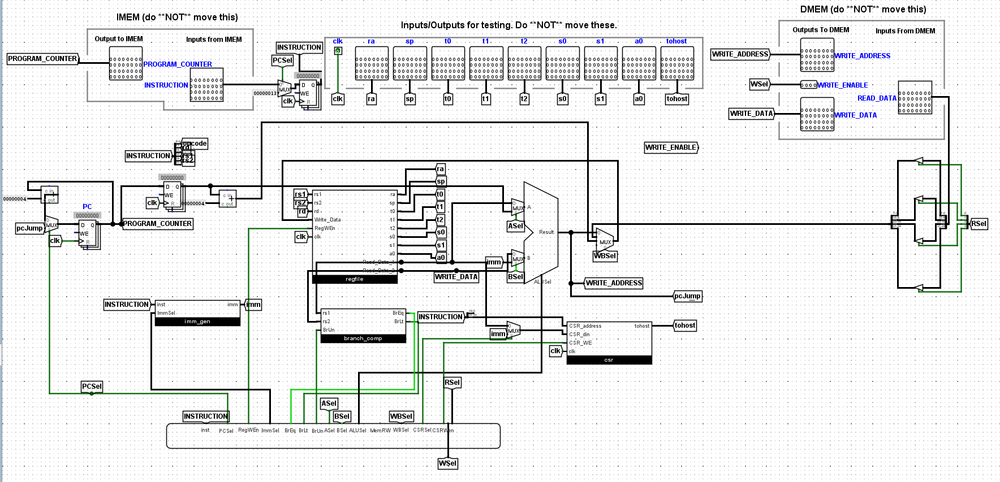
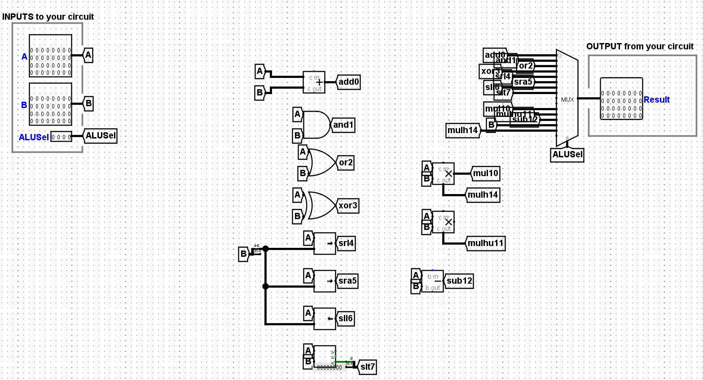
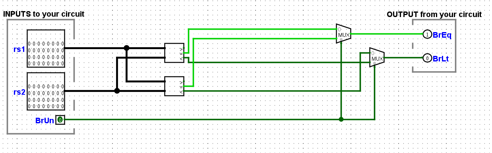
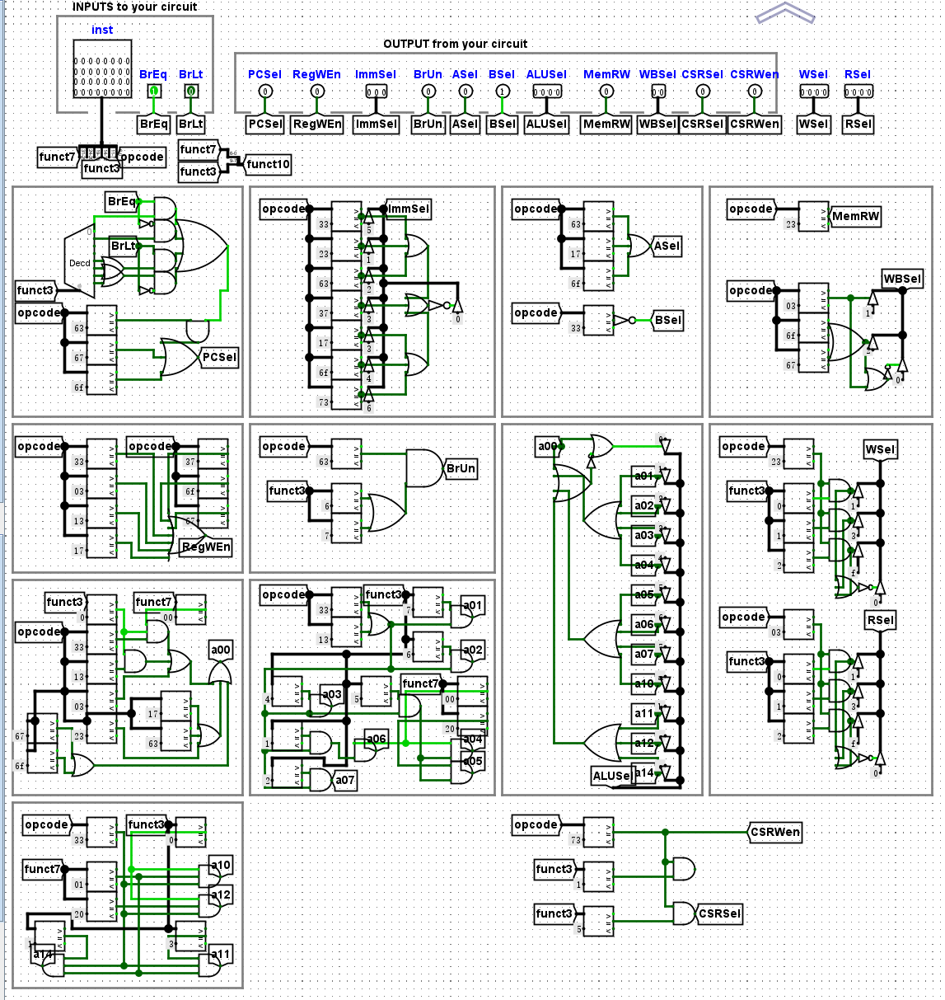
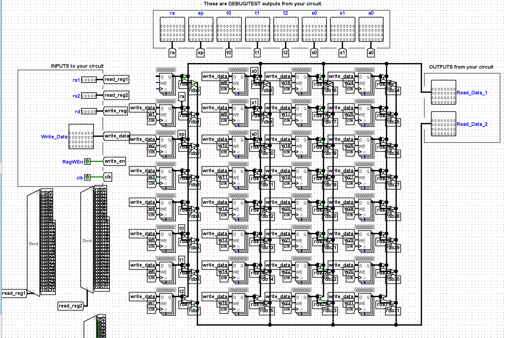

收获心得:
    对RISC-V汇编指令有了深入的理解，尤其是保存上下文操作
    在手写、调试RISC-V汇编程序时，熟悉RISC架构（32个常用寄存器的功能分布、栈寄存器）    
    在某个lab中，对Cache命中率有更好的体会，弥补了书面教学的抽象，彻彻底底懂得了直接映射、组相连映射
    自己动手实现简单的二级流水线CPU，对CPU的开发有了入门级的了解
                        完成于25年7月中旬

后头整理资料时补充：
    CS61c初步建立起了对内存的概念、对机器码的概念———机器码是怎么在程序中运行的？在内存的哪里？
    由于在cs61c中熟悉了RISC-V架构，在后续接触x86的指令时较为平滑，也能具体的感受两种顶级架构的区别
                                                       

下面给出完成Proj3的CPU示意图

